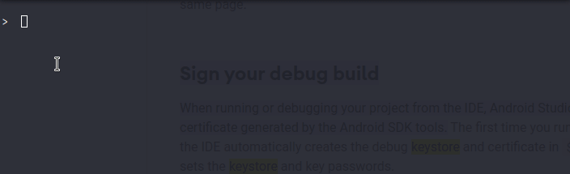
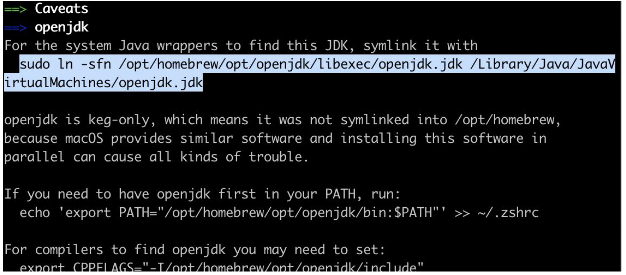
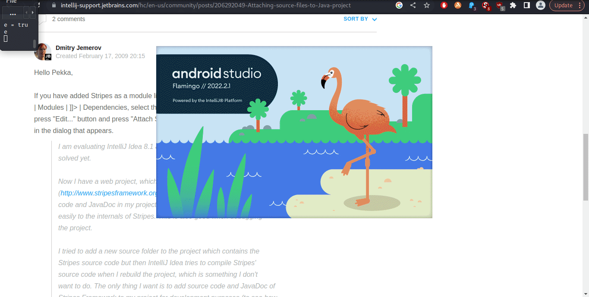
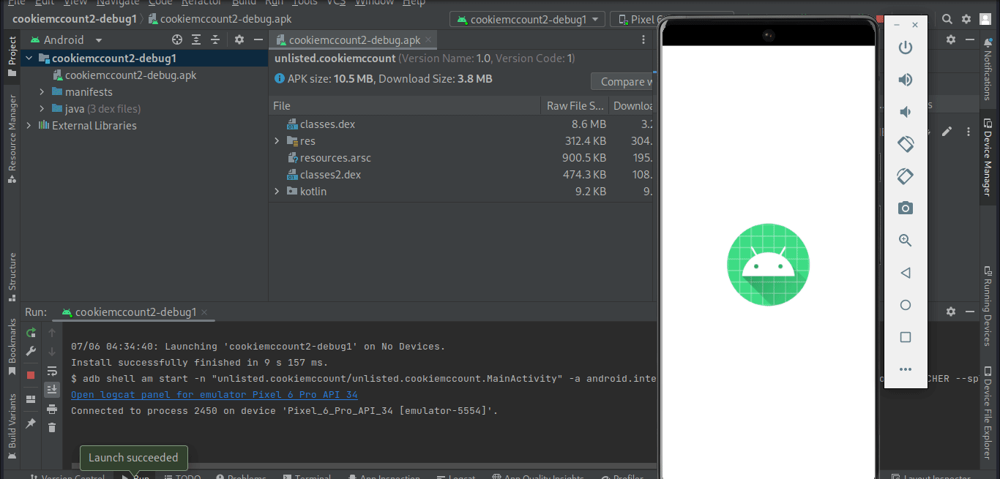

<!-- PROJECT -->
## Purpose of the Exercise
During our class lectures we covered the _Android_ & _IOS_ application architectures from a security standpoint, reviewing security vulnerabilities related to mobile applications such as data leakage and insecure authorization.

This exercise takes these theoretical concepts and applies them in a practical context, providing a hands-on learning experience that reinforces the lecture material. Through static analysis and reverse engineering students get to experience first-hand how data can leak through bad coding practices or how the lack of proper encryption can lead to vulnerabilities.

Through code review and APK analysis, students will gain practical skills that are critical for a mobile/Android application security assessment, which echoes the lecture's focus on mobile security.

## Help CookieMcCount eat cookies!
The primary objective of this exercise is to provide students with practical exposure to various aspects of Android application security. This includes areas such as static analysis, dynamic analysis, and APK verification.

The exercise revolves around the investigation of a sample APK file of a game, `CookieMcCount`, which tracks the number of cookies a player "eats". You are tasked with understanding the inner workings of the game through reverse engineering, APK analysis, and manifest examination in Android Studio. The ultimate goal is to uncover hidden values -- _CODES_ --  related to the game's mechanics.

The exercise is broken down into several parts, each focusing on different aspects:

In `Part 1` you have to employ static analysis and code review to understand the application's logic, with the goal of identifying a specific encrypted value (`STATIC_CODE`).

`Part 2`  involves practical engagement with the APK file using an Android emulator in Android Studio. This part helps you get familiar with Android development tools and how an application behaves during runtime. 

_You do NOT need to have prior Android Studio knowledge or smali code knowledge. Basic coding and IDE/SDK understanding are sufficient for this exercise._ 

`Part 3` prompts you to examine the application's `AndroidManifest.xml` file to understand important aspects of the app's configuration.


### Assignment Breakdown
* All the important source code (`MainActivity.java` and `EncryptUtil.java`), as well as the _.apk_ is provided in the `artifacts` directory

__PART 1__
* 50/100 points can be achieved with static analysis of the provided _smali_ and _java_ source code files
 
__PART 2__
* 10/100 points can be achieved by engaging with the `artifacts/cookiemccount-vX.apk` in an emulator 

__PART 3__
* 40/100 points can be achieved by opening the `.apk` in `Android Studio` to read the `AndroidManifest.xml`

__STRETCH__
* 0 points. There is a `DYNAMIC_CODE` achieved when 1 million cookies are consumed. No points are awarded for the optional part of the exercise, and no TA resources are spent towards supporting it. It is completely optional for students wishing to explore on their own dynamic reversing tools like debuggers. 

_NOTES_
* The Android Studio emulator is a development tool that can have delays and lags. 
  * This assignment serves as a gentle introduction to the tool where the value lies in the exposure to functionality
  * Patience is required while using the emulator
* The `mobile-sec-cookie-mccount-artifacts-v<X>` directory (colloquially called `artifacts`) will be provided in the course LMS. 

<!-- GETTING STARTED -->
### Recommended Tools 
* [Android Studio](https://developer.android.com/studio)
  * Useful for code debugging & emualation for running apk in virtual Android device
  * Useful for SDK and other included build tools such as `adb` and `apksigner`


### Install Android Studio

`Android Studio` cannot run alongside other hypervisors (ie no VirtualBox) so you will need to install it on your host's OS.

The installation process has been extensively documented for all major OS: [https://developer.android.com/codelabs/basic-android-kotlin-compose-install-android-studio](https://developer.android.com/codelabs/basic-android-kotlin-compose-install-android-studio)

Once you have successfully installed  `Android Studio` please review the command line tools now available to you 

In particular `apksigner`: [https://developer.android.com/tools](https://developer.android.com/tools)

### Verify `artifacts/cookiemccount-vX.apk`

The `cookiemccount-vX.apk` was created in `testOnly` mode and signed with AndroidStudio [debug certificate](https://developer.android.com/studio/publish/app-signing#debug-mode).

#### Verify the apk with `apksigner`. 

  * All the hashes should match with those below
  * _Using the `apksigner` tool to verify the certs is reccommended but not required for the assignment_
  
  ```sh
    <STUDIO_INSTALL_PATH>/Android/Sdk/build-tools/<VERSION>/apksigner verify --print-certs cookiemccount-vX.apk`
    Signer #1 certificate DN: C=US, O=Android, CN=Android Debug
    Signer #1 certificate SHA-256 digest: 5fadcbd3e27e7531f30d309164d5489201c9128e29f55630a2a8622cde0870d3
    Signer #1 certificate SHA-1 digest: f22869bdb06df21c548862cd08a2f61f6ce24c0b
    Signer #1 certificate MD5 digest: 231510de9d4c5fd6e4fe2cdeec9607c0
  ```


#### Verify the apk with `sha256` hash algorithm. 
This utility is built into most OS' 


```sh
openssl dgst -sha256 cookiemccount-vX.apk                          # MacOs

sha256sum cookiemccount-xK.apk                                     # Linux

CertUtil -hashfile  <PATH to cookiemccount-vX.apk>  SHA256         # Windows 
```



_NOTE #1: Match the sha256 digest of your apk against `artifacts/sha256.txt`. The digest presented in the gif is possibly generated against a different .apk from yours_


## PART I (50 points) 
Eat _how many_ cookies get  the __STATIC_CODE__?


The `cookiemccount-vX.apk` is a simple Android Button app where 1 click helps the CookieMcCount eat 1 cookie. 
You are rewarded with a code when CookieMcCount consumes the following number of cookies:
* `10` 
* Some `unknown number` > 0 and < 1 million   (the `unknown number` is also referred to as the `STATIC COUNT`)
* 1 million

_E.g. eat 10 cookies by clicking the button 10 times :)  You'll do this in  `Part 2`  when you run the app in the android emulator_

For now let's find a way to figure out that `unknown number`, also known as the `STATIC_COUNT`. 
* The developer has shared partial code and both the `MainActivity.java` file as well as its decompiled _smali code_ `MainActivity.smali` are available to you.
* Not only that, but you also have the exact encryption file (`EncryptUtils.java`) used by the _.apk_ to encrypt/decrypt secrets.

To get the `STATIC CODE`  you need to:
1. Reverse the relevant portion of `MainActivity.smali` to populate line 18 in `MainActivity.java` 
   1. _Check out `smali_example` -- it's a simple java source file and its compiled smali artifact that's enough to understand how a variable is set in smali_
                                                                                                                    

2. After you've figured out line 18 of `MainActivity.java` (which is `STATIC_COUNT`), use `artifacts/EncryptUtil.java` to get the `STATIC_CODE`
   1. _The `STATIC_CODE` is revealed when the `STATIC_CODE_CIPHERTEXT` is decrypted with the `STATIC_COUNT`_

_Here's some help on interacting with `artifacts/EncryptUtil.java` if you need a refresher on running jar files_

 


### `smali_example`
* [MainActivity_ex.java](https://github.com/rollingcoconut/mobile-sec-cookie-mccount.github.io/blob/main/smali_example/MainActivity_ex.java)
* [MainActivity_ex.smali](https://github.com/rollingcoconut/mobile-sec-cookie-mccount.github.io/blob/main/smali_example/MainActivity_ex.smali)
* [hint.md](https://github.com/rollingcoconut/mobile-sec-cookie-mccount.github.io/blob/main/smali_example/hint.md)

_HINT #1_
* You don't need Android Studio just yet to interact with the `.java` or `.smali` code files. Just open your favorite code editor, a notepad app, or even linux vm

_HINT #2_ 
* If you don't have java installed, you should install it
* You can check if you have Java installed but just not on your path as per the following guide: 
    * https://www.baeldung.com/java-check-is-installed
* Alternatively if you don't have `java` installed, go ahead and install it.
  * The assigment will work with both older and newer versions of Java; as JDK 17 is the latest LTS it is recommended for new installs
  * **JDK 17 Downloads** [https://www.oracle.com/java/technologies/downloads/#java17](https://www.oracle.com/java/technologies/downloads/#java17)
  * **JDK installer notes** [https://docs.oracle.com/en/java/javase/17/install/installation-jdk-microsoft-windows-platforms.html](https://docs.oracle.com/en/java/javase/17/install/installation-jdk-microsoft-windows-platforms.html#GUID-BCE568C9-93D3-49F4-9B0C-9DD4A3419792) 
        
* For mac you can use brew install java. Make sure you note and run the  “sudo ln ...” and the “echo... commands”
  * 


## PART II (10 points) Emulate! ENGAGEMENT_CODE

### Open APK in Studio

* Android caters to running/debugging pre-built APKs: https://developer.android.com/studio/debug/apk-debugger
* All we have to do is open the `artifact/cookiemccount-vK.apk` in Android Studio.
* The actions to click are: `Welcome > More Actions > Profile or Debug APK`

_NOTE:_ If it is your first time using `Android Studio` be sure to follow the wizard to install Android SDKs (v 34 is recc). 
* You will be prompted to load the SDK either at start-up, and again perhaps when you run the _.apk_. 
* Choose .v34 if possible
* Should the balloon notification to download the SDK goes away just go to the notifications tab all the way in the left to bring back the latest notifications
* The assignment was created and tested on a `PIXEL 6 PRO API 3{1..4}`



[Enlarge](https://github.com/rollingcoconut/mobile-sec-cookie-mccount.github.io/blob/main/gifs/launched_app_in_studio.gif)
        

_...grab some coffee while emulator loads.._



[Enlarge](https://github.com/rollingcoconut/mobile-sec-cookie-mccount.github.io/blob/main/gifs/running_the_app.gif)

_above gif takes >2 mins fyi_

Just click 10x to get the `ENGAGEMENT_CODE`!


## PART III (40 points) Manifest!

_Answer Q3 and Q5 with either `Yes` or `No`_

_Answer Q6 with a numeric_

### Q3. (10 points) 
* To have continued notifications from the app is it required for the user to grant the `POST_NOTIFICATIONS` permission to the app each time the app is opened? 
  * _HINT 1: You can confirm your answer by navigating to `Settings > Notifications` on the virtual device, just as you would on a physical Android._
  * _HINT 2: [https://www.geeksforgeeks.org/what-are-the-different-protection-levels-in-android-permission/](https://www.geeksforgeeks.org/what-are-the-different-protection-levels-in-android-permission/)_

### Q4. (10 points)
* What is the protection level of the `POST_NOTIFICATIONS` permission? 
  * _HINT 1: [https://developer.android.com/reference/android/Manifest.permission](https://developer.android.com/reference/android/Manifest.permission)_


### Q5. (10 points) 
* According to the `AndroidManifest.xml` does the `CookieMcCount` app run any `Services`?

  * _HINT 1: [https://developer.android.com/guide/topics/manifest/service-element](https://developer.android.com/guide/topics/manifest/service-element)_

### Q6. (10 points)
* According to the `AndroidManifest.xml` what is the minimum SDK required to run `CookieMcCount`?


## Resources
__Android Studio__
* [https://www.coursera.org/professional-certificates/meta-android-developer](https://www.coursera.org/professional-certificates/meta-android-developer)

__Android Permissions__ 
* [https://www.geeksforgeeks.org/what-are-the-different-protection-levels-in-android-permission/](https://www.geeksforgeeks.org/what-are-the-different-protection-levels-in-android-permission/)
* [https://www.geeksforgeeks.org/application-manifest-file-in-android/](https://www.geeksforgeeks.org/application-manifest-file-in-android/)
* [https://mobile-security.gitbook.io/mobile-security-testing-guide/android-testing-guide/0x05h-testing-platform-interaction#custom-permissions](https://mobile-security.gitbook.io/mobile-security-testing-guide/android-testing-guide/0x05h-testing-platform-interaction#custom-permissions)
 
__Android Components__ 
* [https://developer.android.com/guide/topics/manifest/service-element](https://developer.android.com/guide/topics/manifest/service-element)

## ERRATA/HINTS

* If you find the virtual device misbehaving, it often helps to restart the Virtual device with the "cold boot" or to "wipe data"

* It's also not uncommon to accidentally run multiple emulators due to having multiple Studio projects open at once
  * Try closing all IDEs/emulators/terminals if you run into an erratic behaviour.
  * Restarting your machine might also help as that will kill any daemon processes
  * https://stackoverflow.com/questions/73083632/how-to-fix-waiting-for-target-device-to-come-online 

* `cookiemccount{1..10}-vK.apk` and `cookiemccount-vK.apk` are used interchangably in the gifs

* The static code files `MainActivity.java` and `MainActivity.smali` will likely not match the binary as the _.apk_ evolves; they are more than sufficient for learning about smali code however


